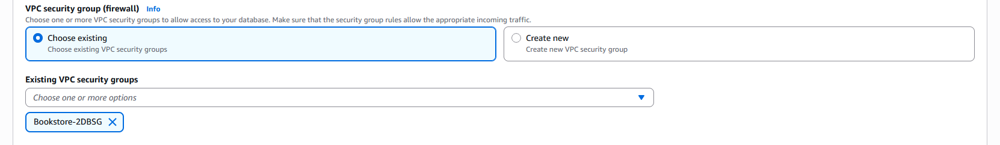
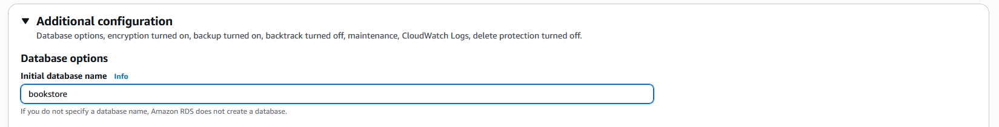
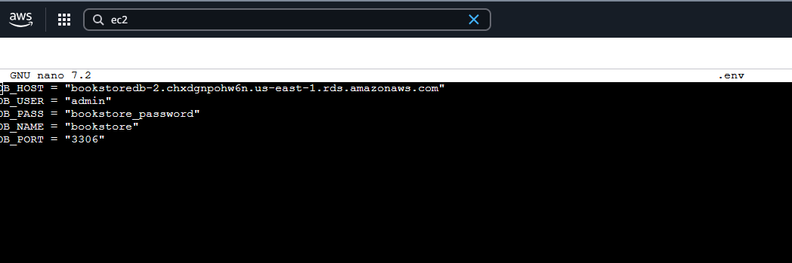
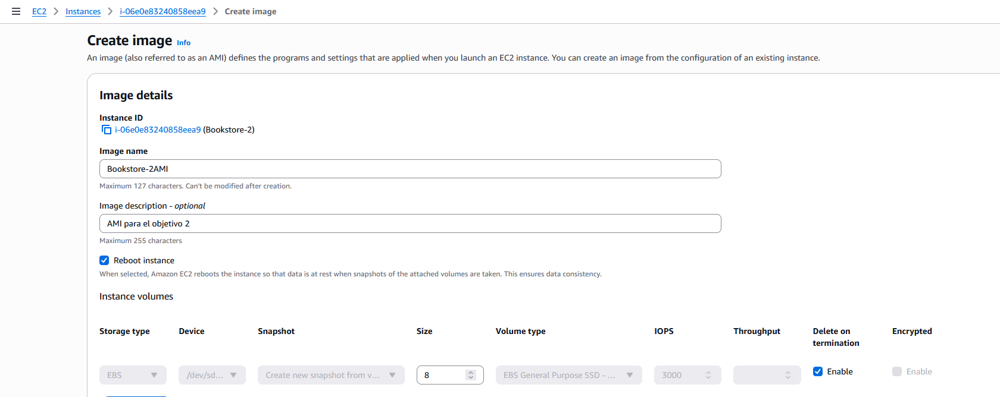
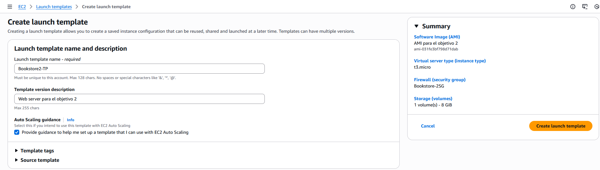
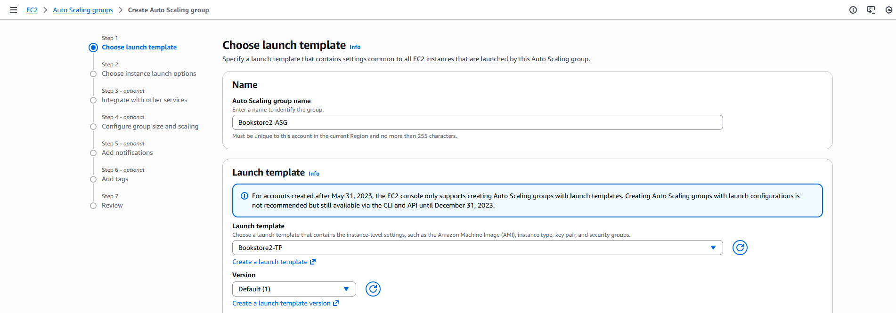
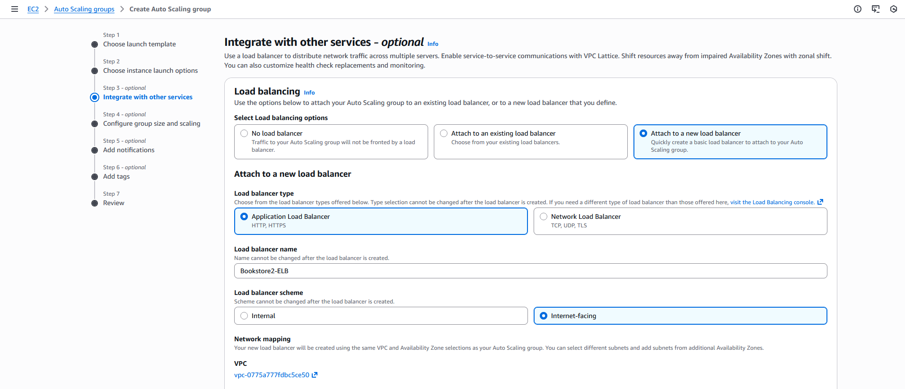
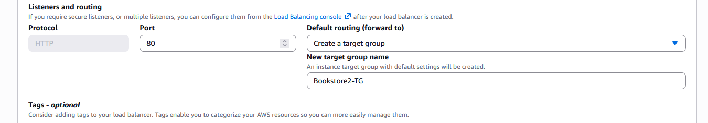

# ST0263 Tópicos Especiales en Telemática
## Estudiante(s): 
- Eduardo Piñeros Manjarres, eapinerosm@eafit.edu.co
- Natalia Ceballos Posada, nceballosp@eafit.edu.co
## Profesor:
- Edwin Montoya Munera, emontoya@eafit.edu.co

# Proyecto 2 – Aplicación Escalable
## 1. Descripción de la actividad
Se tiene ya una aplicación BookStore Monolítica, que simula un Sistema de Ecommerce de Venta de Libros.
BookStore actualmente corre en una sola máquina, con docker, un docker para la base de datos y otro docker para la aplicación. Se usa docker-compose para articular los 2 contenedores (mysql y python-flask).

Este proyecto tiene tres objetivos:
- **Objetivo 1:** Desplegar la aplicación BookStore Monolítica en dos (2) Máquinas Virtuales en AWS, con un dominio propio, certificado SSL y Proxy inverso en NGINX. (un servidor para la base de datos y otro servidor para la aplicación + nginx).
- **Objetivo 2:** Realizar el escalamiento en nube de la aplicación monolítica, siguiente algún patrón de arquitectura de escalamiento de apps monolíticas en AWS. La aplicación debe ser escalada utilizando Máquinas Virtuales (VM) con autoescalamiento, base de datos aparte Administrada o si es implementada con VM con Alta Disponibilidad, y Archivos compartidos vía NFS (como un servicio o una VM con NFS con Alta Disponibilidad), base de datos en RDS.
- **Objetivo 3:** Desplegar la aplicación BookStore monolítica en un clúster kubernetes (EKS o microk8s), evolucionándola desde un despliegue como aplicación monolítica
- **Objetivo 4:** Buscar y desplegar una aplicación libre y de código basada en microservicios, que sea desplegada en un clúster kubernetes, y que integre servicios como EFS, RDS, etc, y que tenga al menos un patrón de replicación de datos como CDRS o similar en al menos un microservicio.

## 2. Desarrollo de los objetivos

### Objetivo 1

----------------------------------

#### 1. Prerrequisitos
- Un dominio web (GoDaddy, Hostinger, Namecheap)
- 2 Maquinas EC2 en AWS (Ubuntu) [Tutorial](https://aws.amazon.com/es/getting-started/hands-on/deploy-wordpress-with-amazon-rds/3)
- 2 Direcciones IP elásticas AWS
#### 2. Pasos

**Creación de los grupos de seguridad**

Lo primero que haremos es crear los grupos de seguridad para nuestras 2 maquinas, uno para el servidor web y otro para la base de datos


-----------------

Se añaden las primeras reglas para permitir el trafico web y conexiones SSH desde cualquier ip, la regla para el trafico MySQL lo definiremos luego


----------------

En este paso es importante que la regla de MYSQL/Aurora apunte al grupo de seguridad que creamos para el servidor web, asi podemos evitar usar ips quemadas lo que nos da flexibilidad al desplegar.

Luego editamos las reglas del primer grupo de seguridad para hacer lo mismo pero en la dirección contraria


----------------------

Asi nuestras 2 máquinas van a poder comunicarse sin problema.

**Creación y configuración de las máquinas EC2**

El próximo paso es instanciar 2 máquinas ec2 y asignarle a cada una su grupo de seguridad y su dirección elástica.
[Tutorial](https://aws.amazon.com/es/getting-started/hands-on/deploy-wordpress-with-amazon-rds/3)

El resultado se debería ver algo asi


-------------------

Nos conectamos a la instancia de la Base de datos, y ejecutamos los siguientes comandos para crear la base de datos y el usuario que usaremos para conectarnos

*Instalamos mysql server*

```sudo apt update -y```

```sudo apt install mysql-server```

```sudo mysql_secure_installation```

Luego de configurar la base de datos ejecutamos las siguientes queries dentro de la base de datos

```sudo mysql```

```CREATE DATABASE bookstore;```

```CREATE USER 'bookstore_user'@'172.31.18.18' IDENTIFIED BY 'password';```

(Cambiar "bookstore" por el nombre de la base de datos, "172.31.18.18" por la ip privada de la instancia del servidor web, y "password" por la clave que se quiera poner)


--------------------------------

esto es necesario para crear el schema que vamos a utilizar asi como el usuario y su contraseña, estos últimos 2 pueden ser cambiados a su gusto.

Y asignamos los permisos del usuario a la base de datos usando 

```
GRANT ALL PRIVILEGES ON bookstore.* TO 'bookstore_user'@'172.31.18.18';
FLUSH PRIVILEGES;
```
```exit```


-----------------------------

Y modificamos la configuracion de mysql para que permita las conexiones a traves de la ip privada de nuestra otra maquina.

```sudo nano /etc/mysql/mysql.conf.d/mysqld.cnf```


---------------------------------

```Ctrl + x```

```sudo systemctl restart mysql```

Luego nos conectamos a la instancia del servidor, en la cual tenemos que instalar docker y nginx, clonar el repositorio y configurar el archivo .env con las variables de la base de datos:

**Comandos**

```sudo apt update -y```

```sudo apt install docker.io -y```

```git clone https://github.com/nceballosp/BookStore```

```cd Bookstore```

```sudo nano .env```


-----------------------------------------

para DB_HOST es importante utilizar la ip privada asignada a la base de datos

Luego de esto ya podemos construir la imagen y correrla en un contenedor.

Ejecutamos:

```sudo docker image build . -t bookstore```

```sudo docker container run -p 5000:5000 -d --name bookstore_c bookstore```


--------------------------------------

Ya con esto tenemos la aplicación corriendo en un contenedor local solo falta redirigir el trafico de nginx a nuestra aplicación


**Instalar y configurar nginx**

```sudo apt install nginx -y```

Creamos el archivo de configuracion para nuestro dominio (bookstoretopicos.shop)

```sudo nano /etc/nginx/sites-available/bookstore```


-------------------------------

Guardamos el archivo y ejecutamos los siguientes comandos para aplicar los cambios correctamente

```
sudo ln -s /etc/nginx/sites-available/bookstore /etc/nginx/sites-enabled/
sudo rm /etc/nginx/sites-enabled/default
sudo nginx -t
sudo systemctl restart nginx
```

Ahora si nos dirigimos a https://bookstoretopicos.shop deberia funcionar la tienda


-------------------------------

**Certificado SSL**

para hacer esto usaremos certbot

```sudo apt install certbot python3-certbot-nginx -y```

contestamos las preguntas y luego ejecutamos el siguiente comando con nuestros dominios

```sudo certbot --nginx -d bookstoretopicos.shop -d www.bookstoretopicos.shop```

**Objetivo cumplido**

------------------------------------

### Objetivo 2

------------------------------------

Para el objetivo 2 usaremos modificaremos una copia de Bookstore-1, configurada para conectarse con otra base de datos del servicio RDS, esta imagen servira como plantilla para nuestro grupo de auto escalado.

## Pasos

### Crear y configurar los grupos de seguridad y la base de datos RDS

Para crear los grupos de seguridad repetiremos los pasos de los grupos de seguridad del objetivo 1

<!-- Agregar fotos de los grupos de seguridad -->

Luego procederemos a crear la base de datos en el servicio RDS de AWS
Elegimos una base de datos MySQL y configuramos un usuario y contraseña que queramos, nosotros usaremos admin y bookstore_password





### Configurar el servidor web
Para configurar el servidor web debemos editar los parametros de la conexion a la base de datos y automatizar la ejecucion del contenedor al encender la maquina, si no queremos usar la misma instancia podemos repetir los pasos del objetivo 1 o hacer una copia de la imagen Bookstore-1.

Primero modificamos el archivo .env para cambiar la base de datos
volvemos a crear la imagen y a instanciar un contenedor con la nueva imagen



```sudo docker image build . -t bookstore```

```sudo docker container run --restart unless-stopped -p 5000:5000 -d --name bookstore_c bookstore```

Luego de esto debemos crear una imagen de esta instancia modificada para ser usada por el autos scaling group



Despues creamo una launch template usando esta imagen y el grupo de seguridad para el objetivo 2 creado al inicio



Creamos el auto scaling group dentro del servicio EC2 de AWS con la template que acabamos de crear



En este paso creamos nuestro Load Balancer y su target group





Luego de crear el autoscaling group y el load balancer debemos configurar nuestro dominio para que apunte a nuestro ELB


### Objetivo 3

-----------------------------

#### Pasos

**Crecion cluster EKS y Node Group**

Elegimos hacerlo con una configuracion personalizada, lo primero que vamos a cambiar va a ser apagar el modo automatico EKS.

Le ponemos un nombre y escogemos el grupo IAM


------------------


Despues ponemos la siguiente configuracion en la pestaña de Redes


--------------------------------

Una vez creado el EKS vamos configurar un Node Group


------------------------------------

Abrimos la CloudShell y ejecutamos los sigueintes comandos:

```
aws eks update-kubeconfig --region us-east-1 --name bookstoreEKS
kubectl get nodes
```

Cambiar bookstoreEKS por el nombre de tu EKS y clonamos el repositorio


```cd BookStore```

-------------------------------------

**Crear EFS**


Creamos un EFS con ID fs-093862ff5652dd241, que usaremos luego.

Despues modificamos las reglas del grupo de seguridad default:


-----------------------------

Volvemos a la Cloud Shell y ejecutamos los siguientes comandos:

```
curl -fsSL -o get_helm.sh https://raw.githubusercontent.com/helm/helm/main/scripts/get-helm-3
chmod 700 get_helm.sh
./get_helm.sh
```


---------------------------------

**Instalar EFS para EKS y ejecutar el manifiesto**

```helm repo add aws-efs-csi-driver https://kubernetes-sigs.github.io/aws-efs-csi-driver/```

```
kubectl apply -f private-ecr-driver.yaml
helm repo update
helm install aws-efs-csi-driver aws-efs-csi-driver/aws-efs-csi-driver \
--namespace kube-system \
--set controller.serviceAccount.create=false \
--set controller.serviceAccount.name=efs-csi-controller-sa
```

Para confirmar que instaló pods de EFS:

```
kubectl get pods -n kube-system | grep efs
```


-------------------------

**Ejecución Manifiestos**
```
nano -w 02app-deployment.yaml
```


---------------------

Cambiar volumeHandle por el id de tu EFS

```
kubectl apply -f 01mysql-deployment.yaml
kubectl apply -f 02app-deployment.yaml
```


-------------------------------------

Finalmente para monitorear:

```
kubectl get pods -–watch
kubectl get all -o wide
```


------------------------------

Nos conectamos en la web con la EXTERNAL-IP 

http://ad2654523a8ac4c8382604bfed22f8c4-1034843709.us-east-1.elb.amazonaws.com


----------------------------

**Objetivo Cumplido**

-----------------------------

### Objetivo 4

-----------------------------

## 2. información general de diseño de alto nivel, arquitectura, patrones, mejores prácticas utilizadas.

## 3. Descripción del ambiente de desarrollo y técnico: lenguaje de programación, librerías, paquetes, etc, con sus números de versiones.


<!-- como se compila y ejecuta.
detalles del desarrollo.
detalles técnicos
descripción y como se configura los parámetros del proyecto (ej: ip, puertos, conexión a bases de datos, variables de ambiente, parámetros, etc)
opcional - detalles de la organización del código por carpetas o descripción de algún archivo. (ESTRUCTURA DE DIRECTORIOS Y ARCHIVOS IMPORTANTE DEL PROYECTO, comando 'tree' de Linux)
opcionalmente - si quiere mostrar resultados o pantallazos  -->

<!-- 4. Descripción del ambiente de EJECUCIÓN (en producción) lenguaje de programación, librerías, paquetes, etc, con sus números de versiones.

 IP o nombres de dominio en nube o en la máquina servidor.

 descripción y como se configura los parámetros del proyecto (ej: ip, puertos, conexión a bases de datos, variables de ambiente, parámetros, etc)

como se lanza el servidor.

una mini guía de como un usuario utilizaría el software o la aplicación

opcionalmente - si quiere mostrar resultados o pantallazos  -->

# 5. otra información que considere relevante para esta actividad.

# Referencias:


