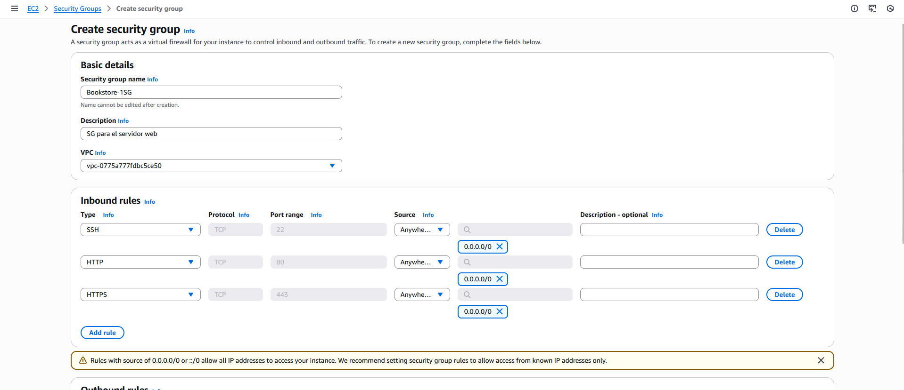
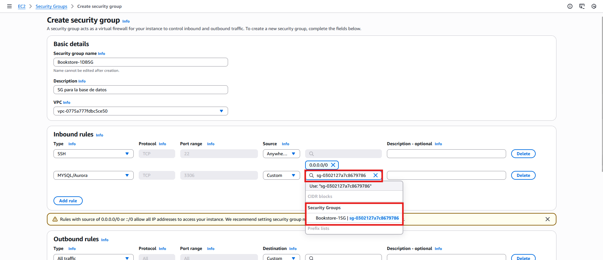
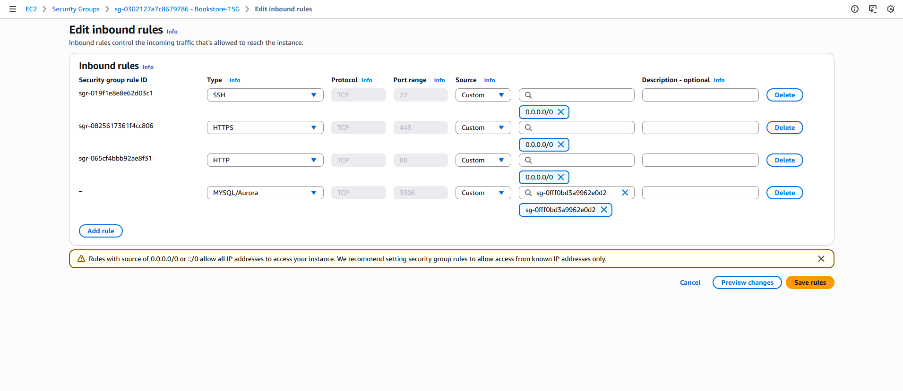
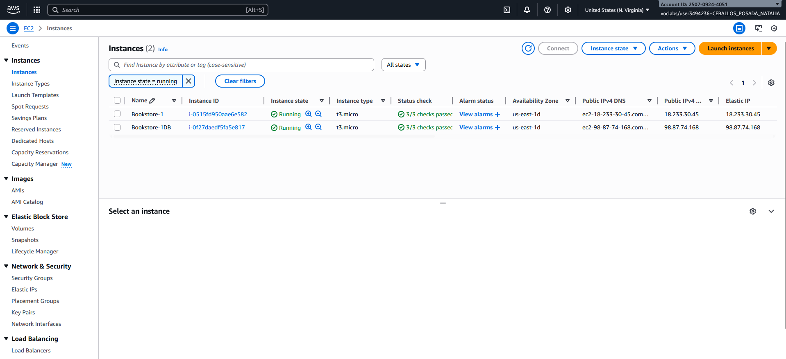
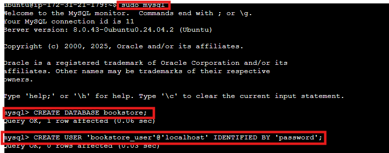
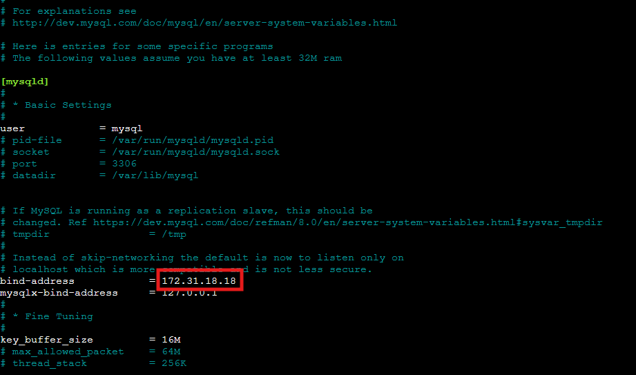
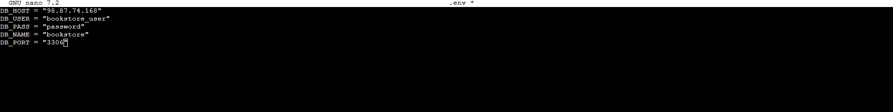
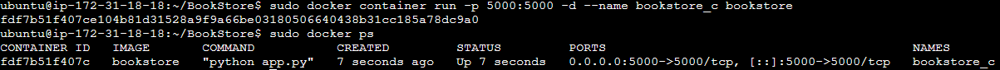
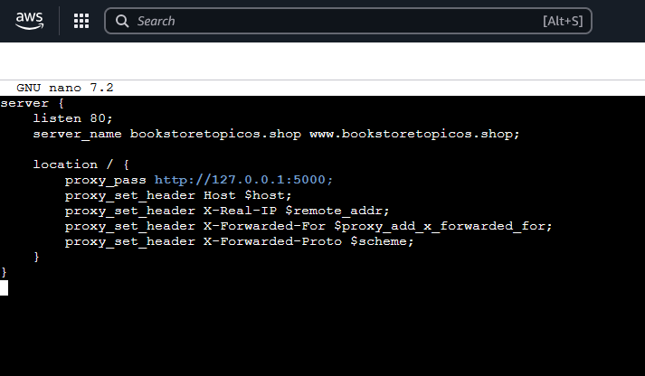
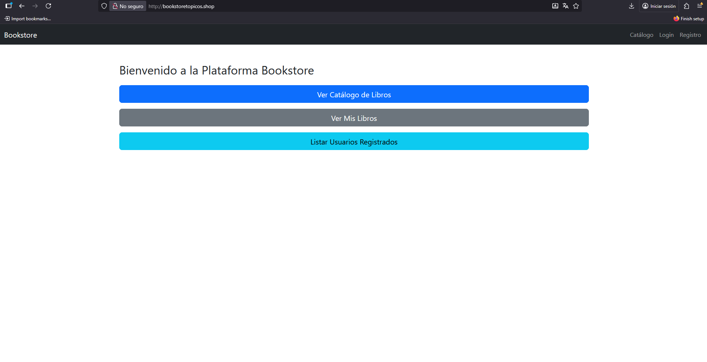

# ST0263 Tópicos Especiales en Telemática
## Estudiante(s): 
- Eduardo Piñeros Manjarres, eapinerosm@eafit.edu.co
- Natalia Ceballos Posada, nceballosp@eafit.edu.co
## Profesor:
- Edwin Montoya Munera, emontoya@eafit.edu.co

# Proyecto 2 – Aplicación Escalable
## 1. Descripción de la actividad
Se tiene ya una aplicación BookStore Monolítica, que simula un Sistema de Ecommerce de Venta de Libros.
BookStore actualmente corre en una sola máquina, con docker, un docker para la base de datos y otro docker para la aplicación. Se usa docker-compose para articular los 2 contenedores (mysql y python-flask).

Este proyecto tiene tres objetivos:
- **Objetivo 1:** Desplegar la aplicación BookStore Monolítica en dos (2) Máquinas Virtuales en AWS, con un dominio propio, certificado SSL y Proxy inverso en NGINX. (un servidor para la base de datos y otro servidor para la aplicación + nginx).
- **Objetivo 2:** Realizar el escalamiento en nube de la aplicación monolítica, siguiente algún patrón de arquitectura de escalamiento de apps monolíticas en AWS. La aplicación debe ser escalada utilizando Máquinas Virtuales (VM) con autoescalamiento, base de datos aparte Administrada o si es implementada con VM con Alta Disponibilidad, y Archivos compartidos vía NFS (como un servicio o una VM con NFS con Alta Disponibilidad), base de datos en RDS.
- **Objetivo 3:** Desplegar la aplicación BookStore monolítica en un clúster kubernetes (EKS o microk8s), evolucionándola desde un despliegue como aplicación monolítica
- **Objetivo 4:** Buscar y desplegar una aplicación libre y de código basada en microservicios, que sea desplegada en un clúster kubernetes, y que integre servicios como EFS, RDS, etc, y que tenga al menos un patrón de replicación de datos como CDRS o similar en al menos un microservicio.

## 2. Desarrollo de los objetivos

## **Objetivo 1**
## 1. Prerrequisitos
- Un dominio web (GoDaddy,Hostinger,Namecheap)
- 2 Maquinas EC2 en AWS (Ubuntu) [Tutorial](https://aws.amazon.com/es/getting-started/hands-on/deploy-wordpress-with-amazon-rds/3)
- 2 Direcciones IP elásticas AWS
## 2. Pasos
### Creación de los grupos de seguridad
Lo primero que haremos es crear los grupos de seguridad para nuestras 2 maquinas, uno para el servidor web y otro para la base de datos

Se añaden las primeras reglas para permitir el trafico web y conexiones SSH desde cualquier ip, la regla para el trafico MySQL lo definiremos luego

En este paso es importante que la regla de MYSQL/Aurora apunte al grupo de seguridad que creamos para el servidor web, asi podemos evitar usar ips quemadas lo que nos da flexibilidad al desplegar.
Luego editamos las reglas del primer grupo de seguridad para hacer lo mismo pero en la dirección contraria

Asi nuestras 2 máquinas van a poder comunicarse sin problema.

### Creación y configuración de las máquinas EC2
El próximo paso es instanciar 2 máquinas ec2 y asignarle a cada una su grupo de seguridad y su dirección elástica.
[Tutorial](https://aws.amazon.com/es/getting-started/hands-on/deploy-wordpress-with-amazon-rds/3)

El resultado se debería ver algo asi



Nos conectamos a la instancia de la Base de datos, y ejecutamos los siguientes comandos para crear la base de datos y el usuario que usaremos para conectarnos

*Instalamos mysql server*

```sudo apt update -y```

```sudo apt install mysql-server```

```sudo mysql_secure_installation```

Luego de configurar la base de datos ejecutamos las siguientes queries dentro de la base de datos

esto es necesario para crear el schema que vamos a utilizar asi como el usuario y su contraseña, estos últimos 2 pueden ser cambiados a su gusto.

Y asignamos los permisos del usuario a la base de datos usando 
```
GRANT ALL PRIVILEGES ON mi_app_db.* TO 'flask_user'@'localhost';
FLUSH PRIVILEGES;
```


Y modificamos la configuracion de mysql para que permita las conexiones a traves de la ip privada de nuestra otra maquina.

```sudo nano /etc/mysql/mysql.conf.d/mysqld.cnf```
<!-- Corregir imagen para poner ip 0.0.0.0 si no funciona la conexion -->


```sudo systemctl restart mysql```

Luego nos conectamos a la maquina del servidor, en la cual tenemos que instalar docker y nginx, clonar el repositorio y configurar el archivo .env con las variables de la base de datos:

**Comandos**

```sudo apt update -y```

```sudo apt install docker.io -y```

```git clone https://github.com/nceballosp/BookStore```

```cd Bookstore```

```sudo nano .env```

para DB_HOST es importante utilizar la ip elástica asignada a la base de datos

Luego de esto ya podemos construir la imagen y correrla en un contenedor.

Ejecutamos:

```sudo docker image build . -t bookstore```

```sudo docker container run -p 5000:5000 -d --name bookstore_c bookstore```




Ya con esto tenemos la aplicación corriendo en un contenedor local solo falta redirigir el trafico de nginx a nuestra aplicación

**Instalar y configurar nginx**

```sudo apt install nginx -y```

Creamos el archivo de configuracion para nuestro dominio (bookstoretopicos.shop)

``` ```



Guardamos el archivo y ejecutamos los siguientes comandos para aplicar los cambios correctamente

```
sudo ln -s /etc/nginx/sites-available/bookstore /etc/nginx/sites-enabled/
sudo rm /etc/nginx/sites-enabled/default
sudo nginx -t
sudo systemctl restart nginx
```
Listo ahora solo falta el certificado SSL 


para hacer esto usaremos certbot

```sudo apt install certbot python3-certbot-nginx -y```

contestamos las preguntas y luego ejecutamos el siguiente comando con nuestros dominios

```sudo certbot --nginx -d bookstoretopicos.shop -d www.bookstoretopicos.shop```

**Objetivo cumplido**

## **Objetivo 2**
Para el objetivo 2 usaremos modificaremos una copia de Bookstore-1, configurada para conectarse con otra base de datos del servicio RDS, esta imagen servira como plantilla para nuestro grupo de auto escalado.
## Pasos


## 2. información general de diseño de alto nivel, arquitectura, patrones, mejores prácticas utilizadas.

## 3. Descripción del ambiente de desarrollo y técnico: lenguaje de programación, librerías, paquetes, etc, con sus números de versiones.

<!-- como se compila y ejecuta.
detalles del desarrollo.
detalles técnicos
descripción y como se configura los parámetros del proyecto (ej: ip, puertos, conexión a bases de datos, variables de ambiente, parámetros, etc)
opcional - detalles de la organización del código por carpetas o descripción de algún archivo. (ESTRUCTURA DE DIRECTORIOS Y ARCHIVOS IMPORTANTE DEL PROYECTO, comando 'tree' de Linux)
opcionalmente - si quiere mostrar resultados o pantallazos  -->

<!-- 4. Descripción del ambiente de EJECUCIÓN (en producción) lenguaje de programación, librerías, paquetes, etc, con sus números de versiones.

 IP o nombres de dominio en nube o en la máquina servidor.

 descripción y como se configura los parámetros del proyecto (ej: ip, puertos, conexión a bases de datos, variables de ambiente, parámetros, etc)

como se lanza el servidor.

una mini guía de como un usuario utilizaría el software o la aplicación

opcionalmente - si quiere mostrar resultados o pantallazos  -->

# 5. otra información que considere relevante para esta actividad.

# Referencias:


